# Prerequisites 

* Some git terminal, I recommend [Git Bash](https://git-scm.com/downloads) for Windows. On Mac/Linux git can be added directly to the terminal using a homebrew/package manager respectively.
  * 

View/Close Image
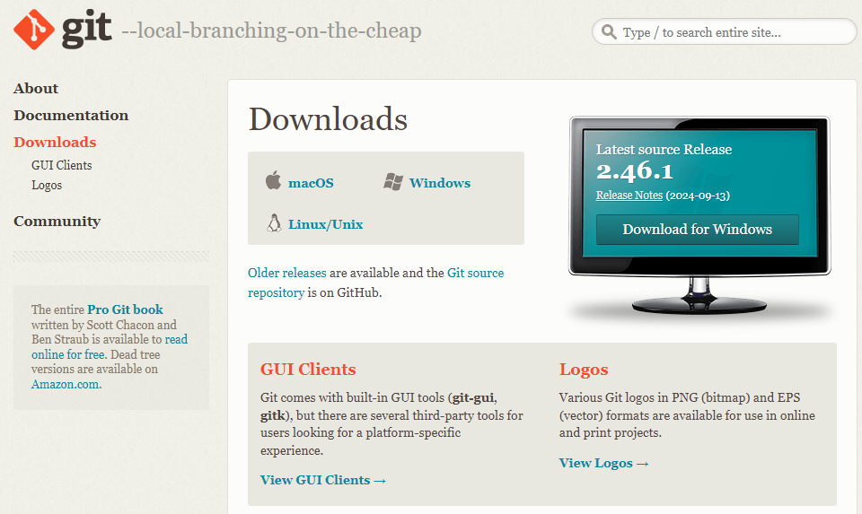

* Some way to edit text files in the terminal, I recommend Vim which comes with Git Bash.
* Some way to generate SSH Keys, I recommend ssh-keygen which comes with Git Bash.
* Some way to view markdown files, I recommend mdview which is avalible on windows/mac/linux. But any text editor works if you have the will and imagination.
  * 

View/Close Image
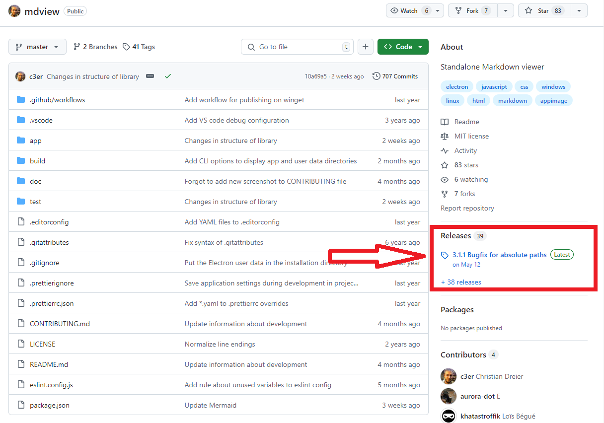

## Guides 

  
Installing Git Bash

  Go to the link for <a href="https://git-scm.com/downloads">Git Bash</a>, and run the installer. Accept all default options.
   

  When this is done, Git Bash should be added to the context menu. On windows 11, by default a subset of the full context menu is shown on right click. You can open the full menu by holding shift while right clicking.
   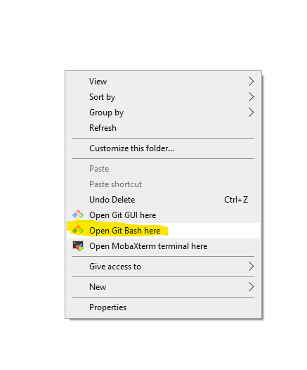

  
Using Vim

  Vim is invoked in the terminal by its name as shown below. You can create new files, or open existing ones by passing the name of the file as an argument.
   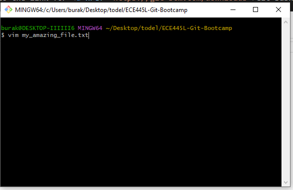

  Once Vim is running you can enter "Insert Mode" by hitting the i key. At any time, you can navigate the file using the arrow keys. 
   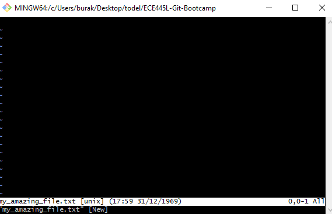

  Once Vim is in "Insert Mode" any text you write will be added to the file. To leave inset mode, and return to the main mode hit the escape key once. 
   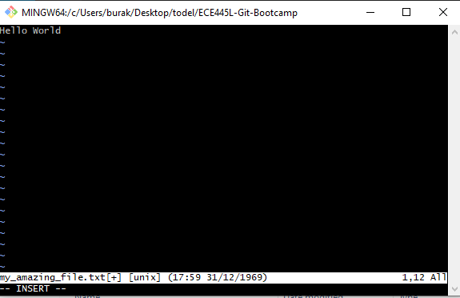

  In the main mode, you can enter commands. The most important command is :wq which means write and quit. 
   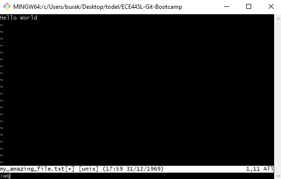

  
Adding SSH Keys to Github

  Navigate to your <a href="https://github.com/settings/keys">Github Security Settings Page</a>. You can see all the SSH authentication keys associated with your account. This process only needs to be done once per computer you use. Click the New SSH key button to continue.
   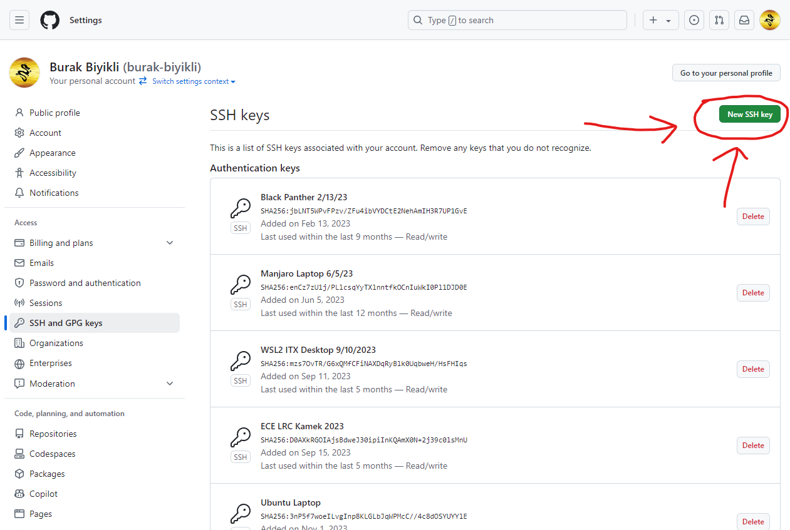

  Give the SSH Key you will add a name, as shown below. Keep this page open as we setup/read the ssh key on your computer.
   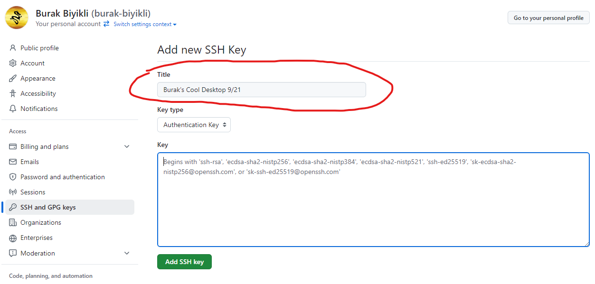

  Open a terminal such as git bash then enter the following command. You can manually type n to not override if it comes up, but you should be able to blindly hit enter accepting default settings.
  <code>mkdir -p ~/.ssh && cd ~/.ssh && ssh-keygen</code>
   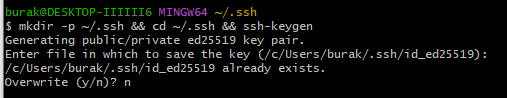
   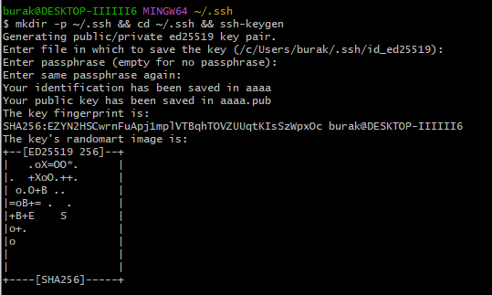

  Now open the created file in vim or your text editor of choice. You can run the command below if you accepted defaults. You will copy all the text in this file.
  <code>vim id_ed25519.pub</code>
   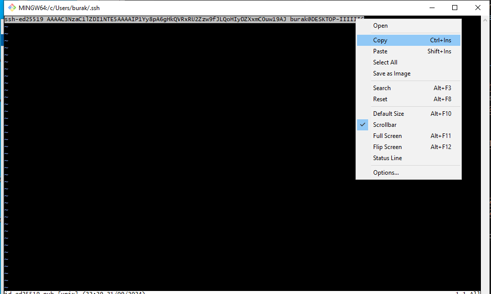

  Then paste this text into the page in git as shown. After hitting Add SSH Key you may need to enter a 2fA token. Then you are done.
   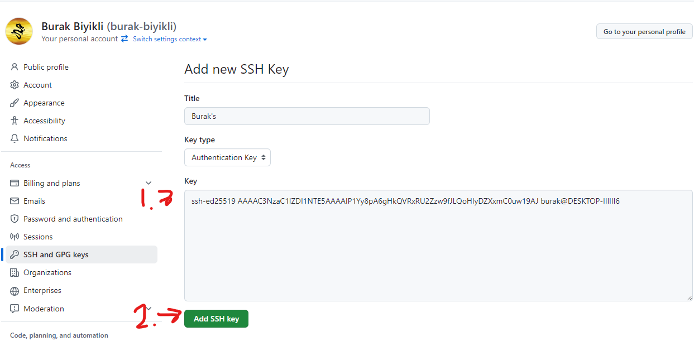

  
Installing Markdown View (mdview)

  Go to the link for <a href="https://github.com/c3er/mdview">mdview</a>, and navigate to the releases section shown in the image below.
   

  Here there will be a list of assets you can download, select the one coresponding you your machine's operating system.
   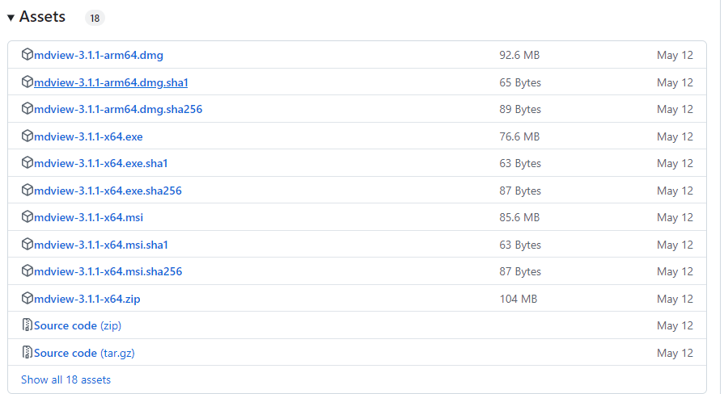

  You may need to add markdown view as the default application to open markdown files as shown:
   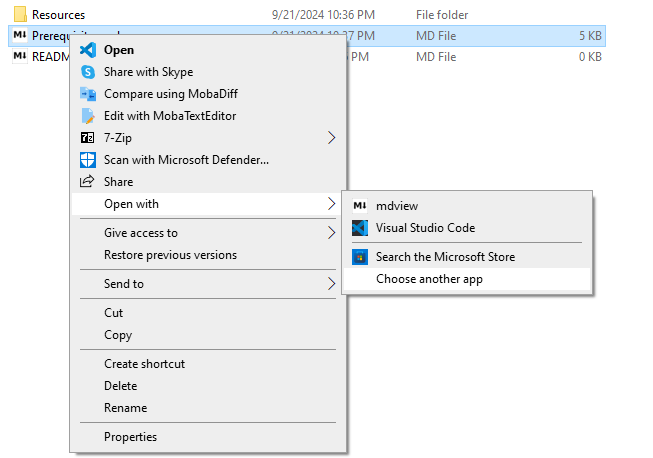
   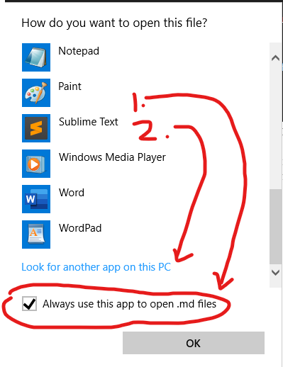
   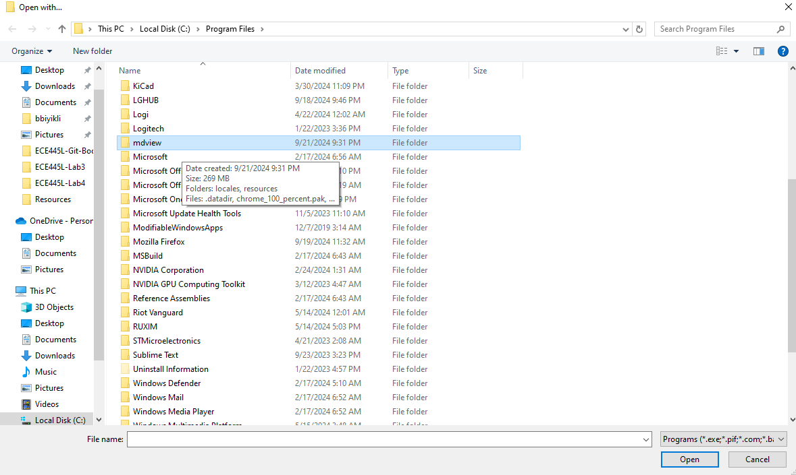
   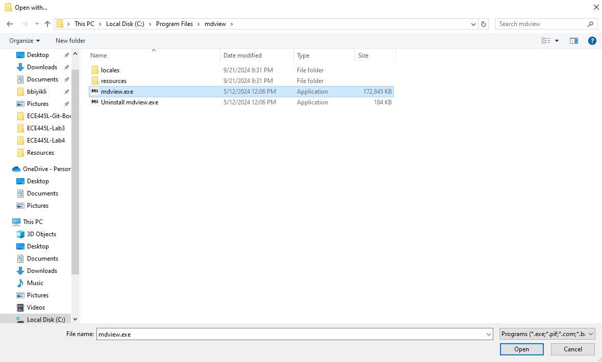

