# Learning Enough to become "Dangerous"

Now we will do some practical excersizes to familarize you with common commands.

## Guides 

Cloning your first repository

	
* Generally, you would find or create a git repo. For this tutorial you will navigate to <a href="https://classroom.github.com/a/KnHFmM-J"> A Github Classroom Link </a> which will create a repo for you.
* After navigating to the classroom, hit accept, then follow the link as shown.
  * 

Accepting the assignment
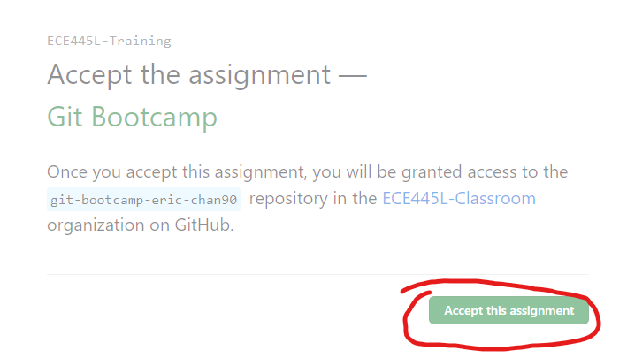

  * 

Following the link
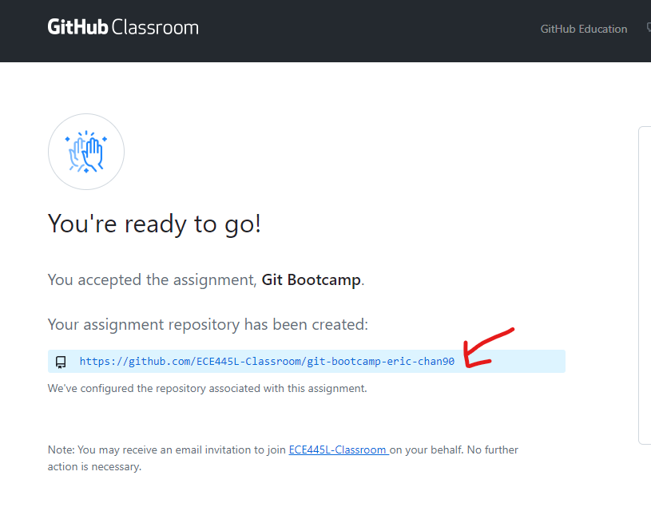

* Once you are in the repository click on code, ssh, then copy the link. 
  * If you see a warning message like below, follow the guide "Adding SSH keys to github" from the prior guide.
  * 

Close/View image
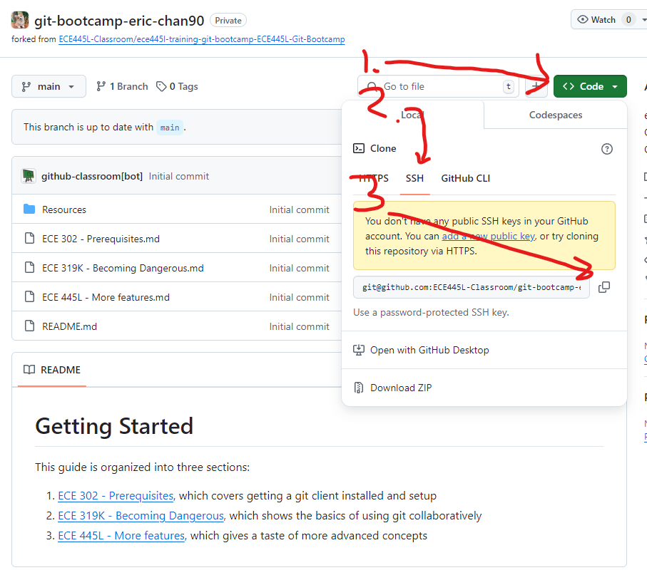

* Navigate to a folder where you would like to clone a repository and open the git bash terminal. Enter the command shown below. Once this finishes you should see a new folder apear. You just cloned a git repo!
  * <code> git clone [Copied link] </code>
  * 

Opening Terminal
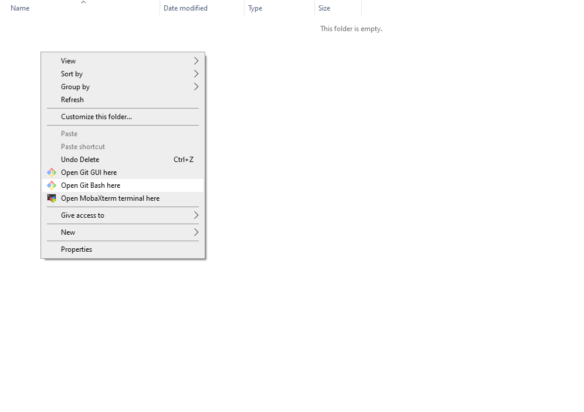

  * 

Entering Command
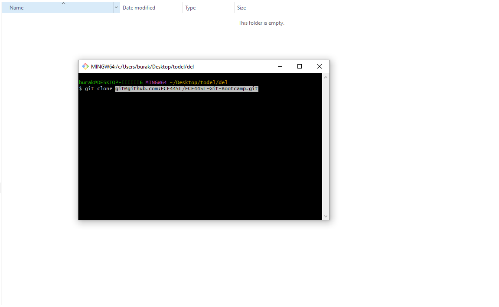

  * 

Result
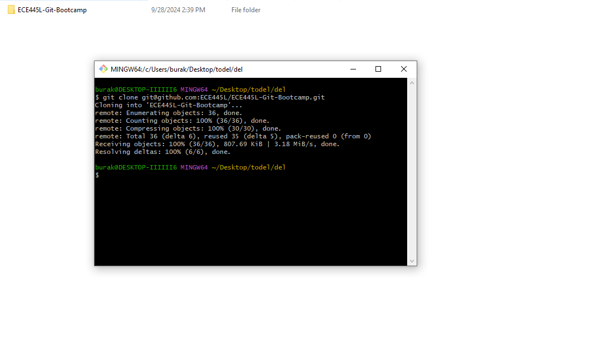

* Run <code>cd ECE445L-Git-Bootcamp</code> from the already open terminal to navigate into the repo. Then run <code>git status</code> to see the status of the repository.

Making your first changes

* Open the terminal in the github repository you cloned. In general, when collaborating it is good to make sure that your repo is up to date.
  * Check the status using the command <code>git status</code>
  * To get the most recent changes use <code>git pull</code>
* (First Time Only) In git, we can see who contributed what. Before you can add changes, add your name and email as shown. This only needs to be done once per machine, and git will error and notify you if you haven't added this info.
  * <code>git config --global user.name "My Name"</code>
  * <code>git config --global user.email "myemail@example.com"</code>
  * 

Example
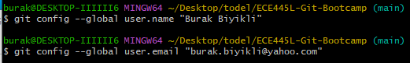

* Now lets make some changes to the repository. Specifically lets add a new file named test 1.
  * Run the command <code>echo "test1" > test1.txt</code> to create a text file. 
  * Alternatively practice using vim. 
    * Start vim using run <code>vim test1.txt</code>, 
    * Hit i to enter insert mode
    * Enter text such as "test1"
    * Leave insert mode, and enter command mode by hiting escape
    * Type ":wq" to write and quit
* Now lets make changes to one of the existing files in the repository. Maybe add an extra enter or the text "test1" to one of the .md files.
* (Optional) Run <code>git status</code>. You should see that there are changes to tracked/untracked files.
  * Tracked files are 'known' by git. These files even if deleted on your machine are backed up by git.
  * Untracked files are 'unkown' to git, only the working copy exists. Build artifacts are common files to leave untracked.
* At the top of the repository, run the three commands as follows
  * Add all unignored files to tracking by running <code>git add .</code>
    * We could have also done <code>git add test1.txt</code> to add only one file
  * Label the changes using <code>git commit -m "test1"</code>
  * Upload the changes to github using <code>git push</code>
* You are done! At this point returning to github.com you should see your updated changes as shown
  * 

Getting to the commit log, from Github.com Repo 'home'
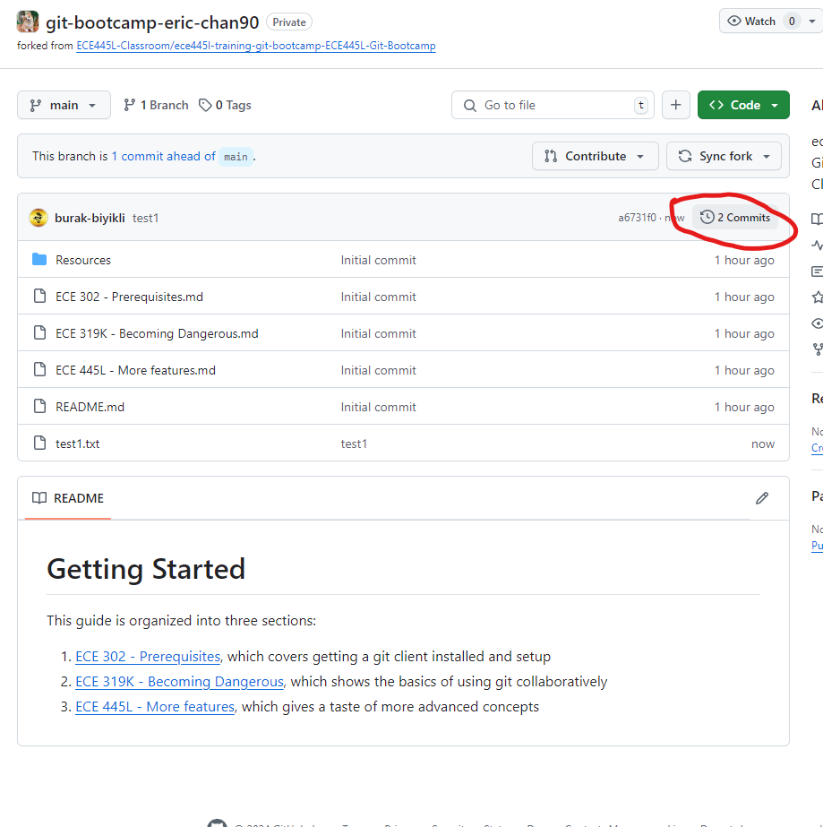 then you should see 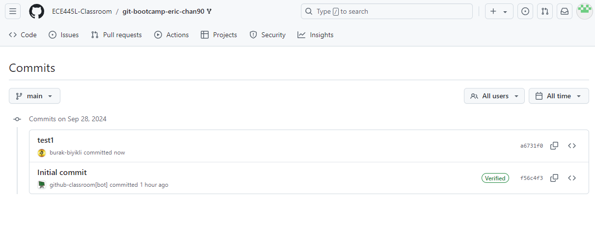

Reverting to the latest commit

* Sometimes we break our code, or even our git repository. It is useful to know a way to get back to a known good state. This can be done simply with three commands
  * <code>git checkout main</code>
    * This will reattach the head if you performed an operation that detached it
  *  <code>git reset --hard HEAD</code>
    * This will restore all files tracked by git to the state they were in during the last commit in the main branch.
  *  <code>git clean -xdf</code>
    * This will delete all untracked files in the git repositiory
* It is also possible to revert some/all files to their state from a prior commit, which is covered later.

Automatic merge conflict resolution

* Merging occurs when multiple people are working on a repository at the same time. We will simulate this by pushing files from while using an older copy of the repository.
* Reverting the state of the repo is done using commit hashes. Navigate to your git repository, click on the commit log, then copy the commit hash as shown. After this run <code>git reset --hard [commit hash]</code> as shown.
  * 

Web page
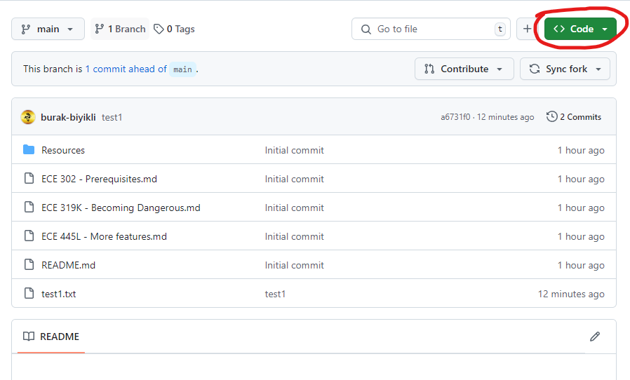

  * 

Commit Log
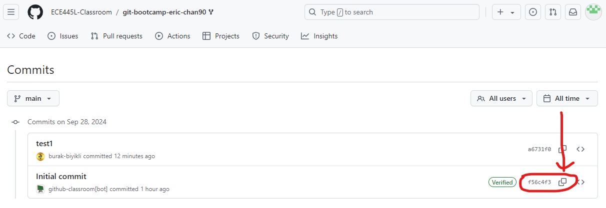

  * 

Reverting repo
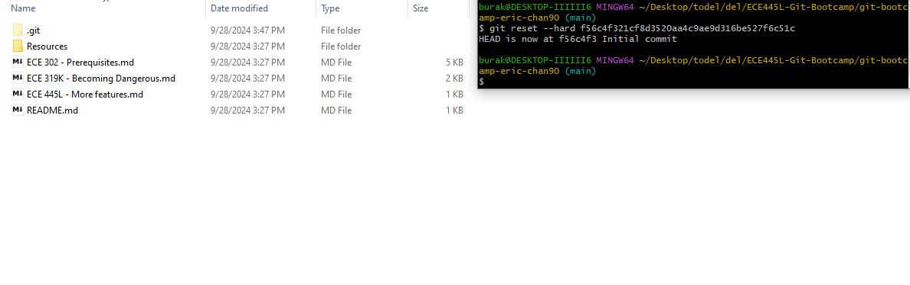

* Note that the repo is back to its original state before the test1.txt file was added.
* Create a test2.txt file
  * Run the command <code>echo "test2" > test2.txt</code>
  * Alternatively practice using vim. 
    * Start vim using run <code>vim test2.txt</code>, 
    * Hit i to enter insert mode
    * Enter text such as "test2"
    * Leave insert mode, and enter command mode by hiting escape
    * Type ":wq" to write and quit
* Attempt to push as normal using the following sequence of commands. Note that we expect the push to fail as shown.
  * <code>git add .</code> then <code>git commit -m "test2"</code> followed by <code>git push</code>
  * 

Failed Push
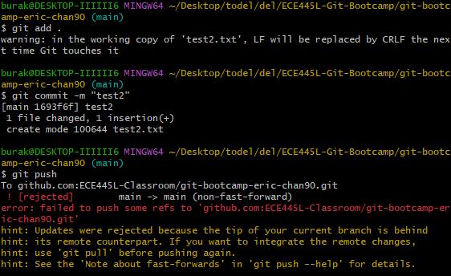

  * The commit failed because someone else pushed or we did not pull before making changes. Now we need to merge our changes. 
* To start merging we run <code>git pull</code> to get the newest code from the repo. In this case, the changes are unrelated, and we merge automatically successfully.
  * An autogenerated commit message will apear. You can edit it, but most of the time you will just enter ":wq" to accept the commit message.
  * 

Auto merge message
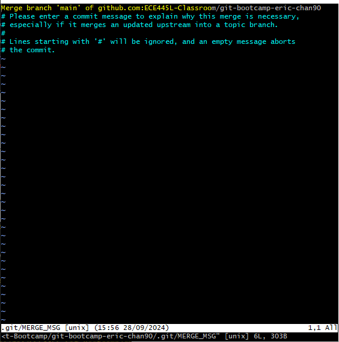

* Now simply run <code>git push</code> to add the changes to your github repo.
  * 

git push message
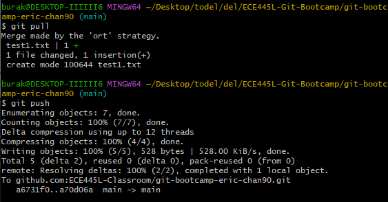
 
* Now the changes should be viewable in the commit log. One commit we added manually, and one commit from the merge.
  * 

Commit log
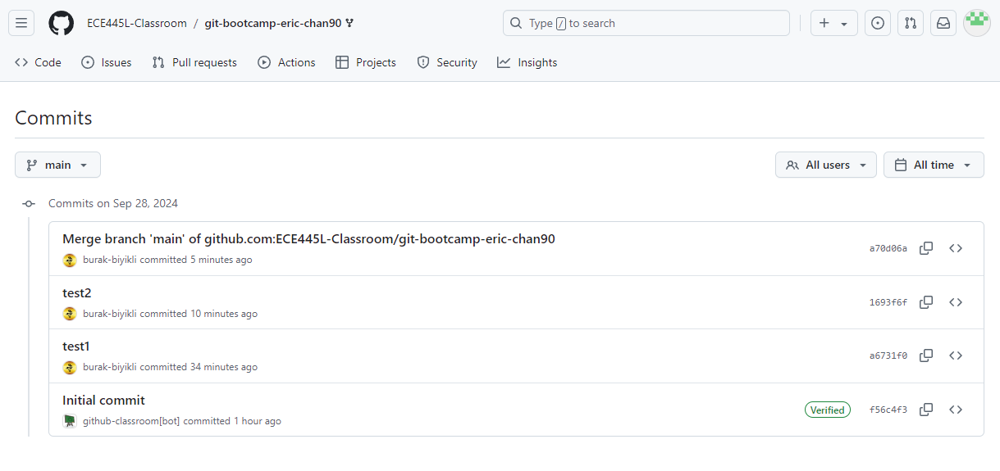
 

Manual merge conflict resolution

* Now lets do a manual merge example. This occurs when git cannot resolve the merge automatically. Typically large changes to small files, or changes to the same text will cause a merge to fail.
* Return to the commit log, and copy the inital commit. Then run <code>git reset --hard [commit hash]</code> as shown.
  * 

Commit log
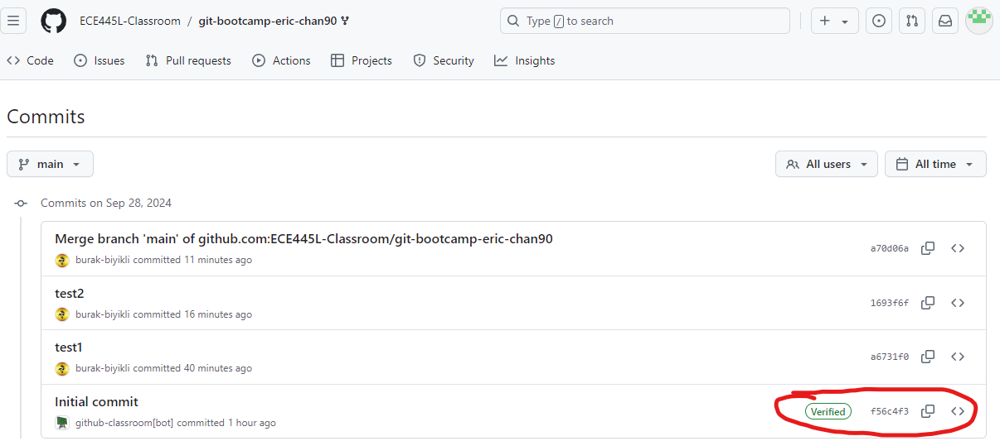

  * 

Commit log
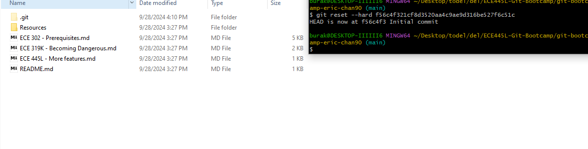

* Create a test3.txt file, containing the text "test3"
  * <code>echo "test3" > test3.txt</code>
* Create a test2.txt file, also containing the text "test3"
  * <code>echo "test3" > test2.txt</code>
* Attempt to push as normal using the following sequence of commands. Note that we expect the push to fail as shown.
  * <code>git add .</code> then <code>git commit -m "test3"</code> followed by <code>git push</code>
  * 

Failed Push
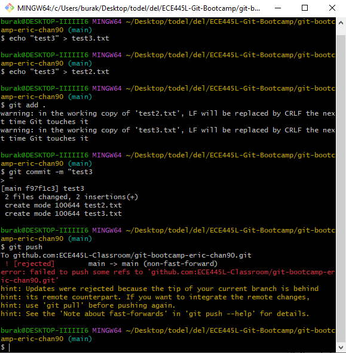

* This is where things diverge from the automatic case. When we pull we recive another error message, stating that it failed to automerge test2.txt
  * Run <code>git pull</code> and note the error message shown, such as the one below.
  * 

Failed Pull
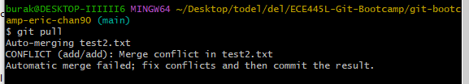

  * All this message means is we need to merge ourself, we should have a mix of files properly merged other than the ones noted.
* Open the file noted, test2.txt. Note that some additional text has been added to identify where the auto merge failed. This additional text also has the commit hashes associated with the version shown. Here in one commit we wrote test2, but in another we wrote test3.
  * 

Pre Merge test2.txt
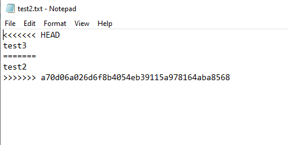

* In order to merge, all we do is delete the extras, and leave behind the desired text. Here I decided that the intention was to write test2, test3. It is entirely free form.
  * 

Post Merge test2.txt
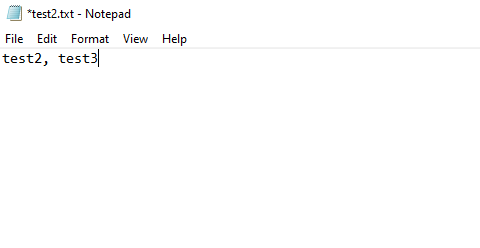

* Once done add the changes, commit them, then push as shown.
  * 

add, commit, and push
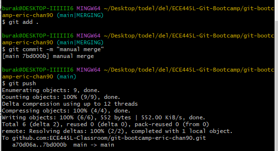

* Now you see the commits show up on the commit log, its Done!
  * 

Final commit log
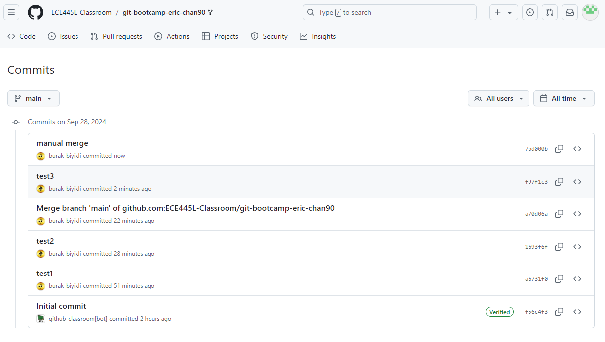

## Next Steps
Once you are done with these exercises continue to [ECE 445L - More features](https://github.com/ECE445L/ECE445L-Git-Bootcamp/blob/main/ECE%20445L%20-%20More%20features.md)