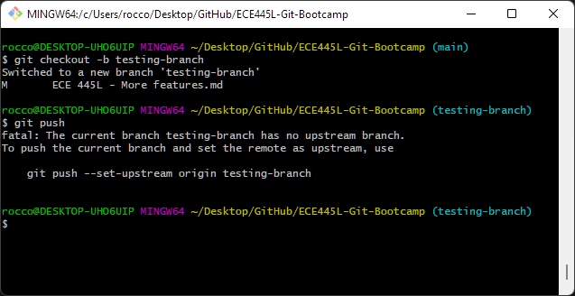
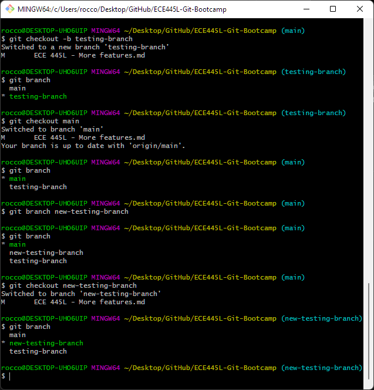
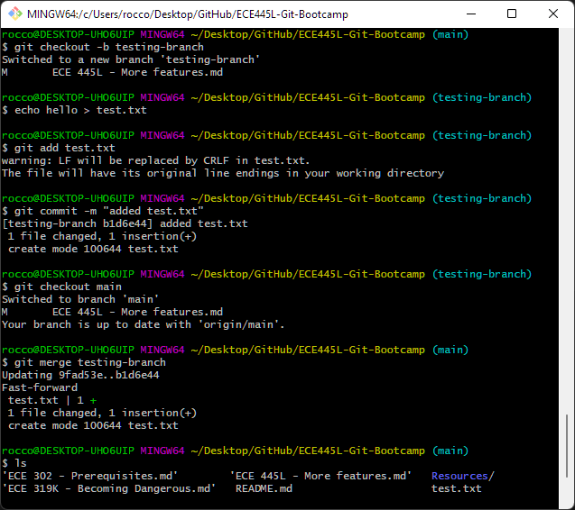

# A Taste of more advanced features

While not strictly needed for this class the following features will help you in larger projects

## Guides 

  
Reverting Specific Files

  * If you want to revert a file to a specific commit, you can use `git checkout [commit hash] -- [file to restore]`

  
Reverting to a Specific Commit

  * `git reset` which we have used in previous sections can also be used to reset the entire repo to a specific commit. `git reset --hard [commit-hash]` will reset the repo **and undo all of the changes made in your local repositroy after that commit**. 
  * If you want to reset to point to an earlier commit without undoing the changes in your local repository, you can remove the `--hard` and use `git reset [commit-hash]`.

  
Creating branches

  * When working on a team or working on a specific features, branching can be very useful in keeping changes organized to specific features or people's work.
  * To create a branch in this repo, run `git checkout -b [branch name]`. This will create a branch and switch you to that branch. Any changes you commit now will be committed to this branch. To switch between already created branches, use `git checkout [branch-name]` (removing the `-b`).
  * When you try to push after creating a branch, you will get this error:
    
  Running the provided command will allow you to push and the branch will show up on the GitHub web interface. You will only have to do this once per branch.
  * Typing `git branch` will list all of the branches in your repository. (You can also use `git branch [branch name]` to create branches, but it does not automatically switch you to the newly created branch.)
  * Here is some varied example usage of the above commands:  
  

  
Merging branches

  * Merging branches (most commonly merging branches for specific features into the main branch) is simple given our automatic and manual merge conflict resolution tools learned previously.
  * To practice merging, create and checkout a test branch. Create a test file with `echo hello > test.txt` and commit it. Then, checkout the destination branch for the merge. In most cases, this will be `main`. Finally, merge with `git merge [test branch name]`.  
  
  * In cases where the two branches involved in the merge have different changes to the same file, git will try to automatically resolve any conflicts, and you may have to resolve the conflicts manually with the steps from the previous section.
  * Keep in mind none of the changes in the above screenshot will be reflected until you `git push`.

  
Squashing commits

## Next Steps
Once you are done with these exercises, read the docs or try working a real project
